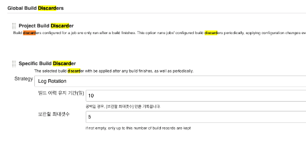
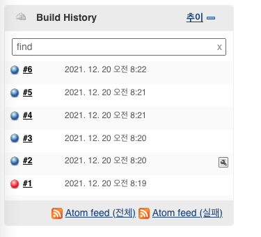
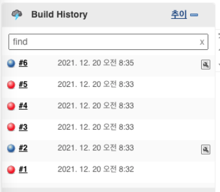
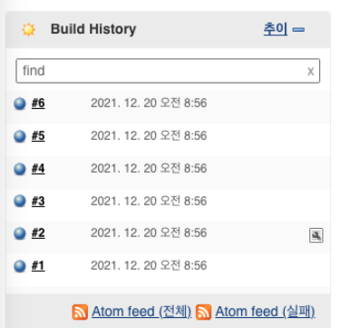

### 일정 기간이 지난 Job 을 삭제하는 Global Build Discarders 를 적용하고 이를 공유한다.

## *Overview*

* Discard Old Builds
    * 기본적으로 각 Item 에서 Discard Old Builds 를 활성화 가능
    * 단, pipeline code 를 통해 수행할 경우 Jenkinsfile 에 옵션이 없다면 default 로 덮어씌우는 문제 발생
* Global Build Discards
    * Discard Old Builds 의 global 설정
    * 설정 방법
        * Manage Jenkins -> Configure System -> Global Build Discarders
        * The Specific Build Discarder 추가: Build Discarder 을 적용한 모든 Job 에 대해 설정 옵션

## *Global Build Discarders 테스트*

3가지 Item (freestyle project, pipeline, multibranch pipeline) 에 대한 테스트를 수행한다.

### 테스트 확인 사항

* Item 별 job 실행 후 설정만큼 build 가 유지되는가?
  * 만약 유지한다면 해당 item 에 대한 테스트 종료
* `보관할 최대갯수`를 유지하는가?
  * e.g) 6번 빌드 수행 시 5개 빌드만 유지하는가?

### Freestyle project

#### 작업

* [x] Job 생성
  * 개인 git repo clone 하는 간단한 작업
* [x] Global Build Discarders 설정
  * 
  * 빌드 이력 유지 기간: 10, 보관할 최대갯수: 5
* [x] Build 6 번 수행
  * 
* [x] Job directory 확인


``` bash
[root@9991b96df245 builds]# ll
total 32
drwxr-xr-x 7 jenkins jenkins 4096 12월 20 08:22 ./
drwxr-xr-x 3 jenkins jenkins 4096 12월 20 08:22 ../
drwxr-xr-x 2 jenkins jenkins 4096 12월 20 08:20 2/
drwxr-xr-x 2 jenkins jenkins 4096 12월 20 08:20 3/
drwxr-xr-x 2 jenkins jenkins 4096 12월 20 08:21 4/
drwxr-xr-x 2 jenkins jenkins 4096 12월 20 08:21 5/
drwxr-xr-x 2 jenkins jenkins 4096 12월 20 08:22 6/
-rw-r--r-- 1 jenkins jenkins    0 12월 19 17:24 legacyIds
-rw-r--r-- 1 jenkins jenkins  126 12월 20 08:22 permalinks
```

* 처음 수행한 1번 빌드 Job 삭제됨을 확인

### Pipeline

#### 작업

* [x] Job 생성

```
pipeline {
   agent any

   stages {
      stage('Hello') {
         steps {
            echo 'Hello World'
            sh 'mkdir -p test001'
            sh 'mkdir -p test002'
         }
      }
   }
}
```

* Jenkins 에서 제공하는 테스트 Jenkinsfile
* [x] Global Build Discarders 설정
  * 빌드 이력 유지 기간: 10, 보관할 최대갯수: 5
* [x] Build 6 번 수행
  * 
* [x] Job directory 확인

``` bash
[root@9991b96df245 builds]# ll
total 32
drwxr-xr-x 7 jenkins jenkins 4096 12월 20 08:35 ./
drwxr-xr-x 3 jenkins jenkins 4096 12월 20 08:35 ../
drwxr-xr-x 4 jenkins jenkins 4096 12월 20 08:33 2/
drwxr-xr-x 4 jenkins jenkins 4096 12월 20 08:33 3/
drwxr-xr-x 4 jenkins jenkins 4096 12월 20 08:33 4/
drwxr-xr-x 4 jenkins jenkins 4096 12월 20 08:33 5/
drwxr-xr-x 4 jenkins jenkins 4096 12월 20 08:35 6/
-rw-r--r-- 1 jenkins jenkins    0 12월 19 17:24 legacyIds
-rw-r--r-- 1 jenkins jenkins  124 12월 20 08:35 permalinks
```

* 처음 수행한 1번 빌드 Job 삭제됨을 확인

### Multibranch Pipeline

#### 작업

* [x] Job 생성
  * branch: main, test001, test002
```
pipeline {
   agent any

   stages {
      stage('Hello') {
         steps {
            echo 'Hello World'
            sh 'mkdir -p test001'
            sh 'mkdir -p test002'
         }
      }
   }
}
```
* [x] Global Build Discarders 설정
  * 빌드 이력 유지 기간: 10, 보관할 최대갯수: 5
* [x] Build 6 번 수행
  * 
* [x] Job directory 확인
  * main branch: 처음 수행한 1번 빌드 Job 삭제됨을 확인
  * test001 branch: 처음 수행한 1번 빌드 Job 삭제됨을 확인
  * test002 branch: 처음 수행한 1번 빌드 Job 삭제됨을 확인
    ``` bash
    [root@9991b96df245 branches]# ll main/builds/
    total 32
    drwxr-xr-x 7 jenkins jenkins 4096 12월 20 08:57 ./
    drwxr-xr-x 3 jenkins jenkins 4096 12월 20 08:56 ../
    drwxr-xr-x 4 jenkins jenkins 4096 12월 20 08:56 2/
    drwxr-xr-x 4 jenkins jenkins 4096 12월 20 08:56 3/
    drwxr-xr-x 4 jenkins jenkins 4096 12월 20 08:56 4/
    drwxr-xr-x 4 jenkins jenkins 4096 12월 20 08:56 5/
    drwxr-xr-x 4 jenkins jenkins 4096 12월 20 08:57 6/
    -rw-r--r-- 1 jenkins jenkins    0 12월 20 08:56 legacyIds
    -rw-r--r-- 1 jenkins jenkins  126 12월 20 08:57 permalinks
    [root@9991b96df245 branches]# ll test001/builds/
    total 32
    drwxr-xr-x 7 jenkins jenkins 4096 12월 20 08:59 ./
    drwxr-xr-x 3 jenkins jenkins 4096 12월 20 08:59 ../
    drwxr-xr-x 4 jenkins jenkins 4096 12월 20 08:59 2/
    drwxr-xr-x 4 jenkins jenkins 4096 12월 20 08:59 3/
    drwxr-xr-x 4 jenkins jenkins 4096 12월 20 08:59 4/
    drwxr-xr-x 4 jenkins jenkins 4096 12월 20 08:59 5/
    drwxr-xr-x 4 jenkins jenkins 4096 12월 20 08:59 6/
    -rw-r--r-- 1 jenkins jenkins    0 12월 20 08:56 legacyIds
    -rw-r--r-- 1 jenkins jenkins  126 12월 20 08:59 permalinks
    [root@9991b96df245 branches]# ll test002/builds/
    total 32
    drwxr-xr-x 7 jenkins jenkins 4096 12월 20 09:01 ./
    drwxr-xr-x 3 jenkins jenkins 4096 12월 20 09:01 ../
    drwxr-xr-x 4 jenkins jenkins 4096 12월 20 09:00 2/
    drwxr-xr-x 4 jenkins jenkins 4096 12월 20 09:01 3/
    drwxr-xr-x 4 jenkins jenkins 4096 12월 20 09:01 4/
    drwxr-xr-x 4 jenkins jenkins 4096 12월 20 09:01 5/
    drwxr-xr-x 4 jenkins jenkins 4096 12월 20 09:01 6/
    -rw-r--r-- 1 jenkins jenkins    0 12월 20 08:56 legacyIds
    -rw-r--r-- 1 jenkins jenkins  126 12월 20 09:01 permalinks
    ```


## *참고*

* [https://support.cloudbees.com/hc/en-us/articles/215549798-Best-Strategy-for-Disk-Space-Management-Clean-Up-Old-Builds](https://support.cloudbees.com/hc/en-us/articles/215549798-Best-Strategy-for-Disk-Space-Management-Clean-Up-Old-Builds)
