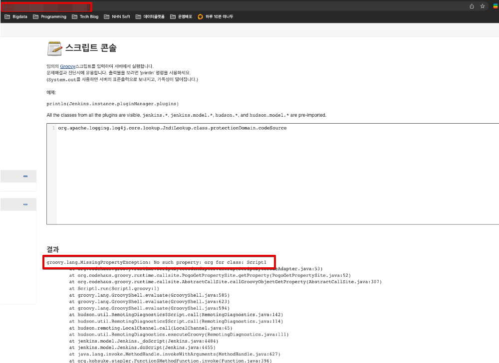
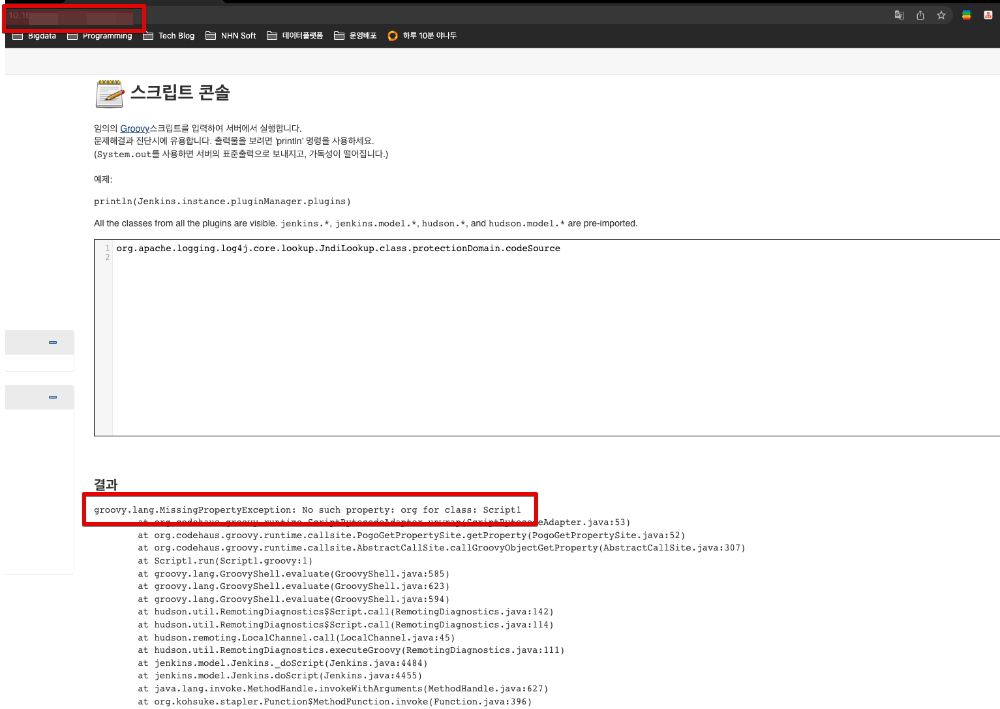

### Jenkins.io 탐방 중 21년도 최대 이슈인 log4j 취약점 관련 내용이 있어 공유한다.

* https://www.jenkins.io/blog/2021/12/10/log4j2-rce-CVE-2021-44228/

## Jenkins 의 Log4j
* Jenkins 보안팀은 Log4j가 Jenkins 코어에서 사용되지 않음을 확인했다고 한다.
* Jenkins 플러그인이 Log4j를 사용 중일 수 있다. 간단히 확인하는 방법은 스크립트 콘솔에서 다음 Groovy 스크립트를 실행하여 Log4j가 플러그인에 포함되어 있는지 알 수 있다.

```groovy
org.apache.logging.log4j.core.lookup.JndiLookup.class.protectionDomain.codeSource
```

* 만약 다음 오류가 발생하면 Log4j가 설치 및 활성화된 플러그인이 없는 것이다.

```
groovy.lang.MissingPropertyException: No such property: org for class: Script1
```

* 만약 오류가 발생하지 않는다면.. (`log4j 가 설치된 플러그인이 존재한다는 것!`)
    *  스크립트 출력은 경로에 플러그인 이름을 포함하는 Log4j가 있는 한 위치를 확인한다. (설치된 플러그인 확인)
    *  해당 플러그인을 비활성화하거나 제거한 다음 Jenkins 를 다시 시작하고 위 오류 메시지가 나타날 때까지 스크립트를 실행한다.
    *  영향받은 플러그인은 [Jira Epic](https://issues.jenkins.io/browse/JENKINS-67353) 확인 가능하다.

### Jenkins 에서 script console 수행 결과




#### 모두 오류 발생 -> log4j 을 사용하는 플러그인 존재 X!

## web application containers 의 Log4j
* Tomcat, Websphere 또는 Glassfish 와 같은 별도의 웹 애플리케이션 컨테이너에서 Jenkins 를 호스팅하는 경우 취약한 버전의 Log4j를 사용하고 있는지 확인해야한다.
* Jenkins 가 Docker 이미지에서 실행되거나 java -jar jenkins.war 로 호출되면 별도의 웹 애플리케이션 컨테이너 내에서 실행하지 않는다.
    * Jenkins 내부에 번들로 제공되며 Log4j를 포함하지 않는 내장 Jetty 웹 애플리케이션 컨테이너를 사용하고 있음
    * `CI/CD 모두 Docker 이미지에 실행되므로 Jetty 를 사용 -> log4j 사용하지 않음 -> 안전!`


## 참고
* https://www.jenkins.io/blog/2021/12/10/log4j2-rce-CVE-2021-44228/
* https://status.jenkins.io/
    * jenkins 에서 발생한 주요 이슈 트래킹
